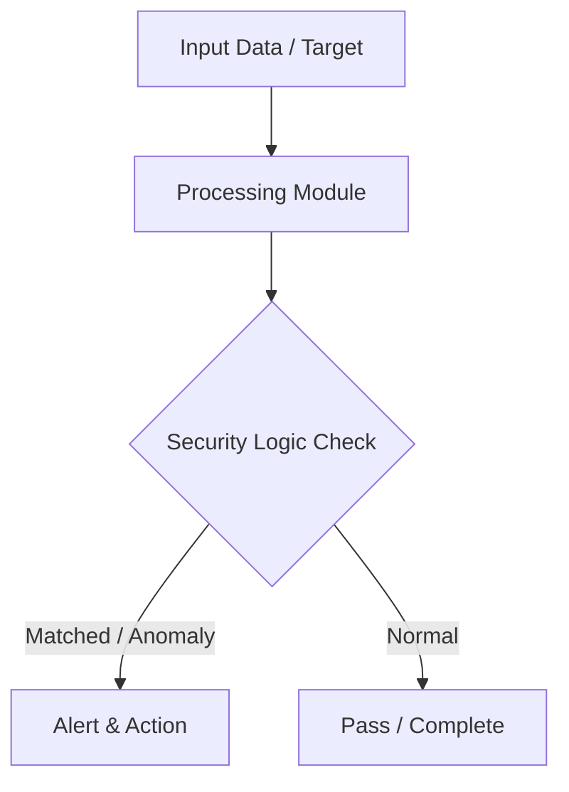

# 008 - Basic Directory Bruteforce Scanner for Web Servers

> **Category**: Basic Cybersecurity Projects | **Difficulty**: ⭐ Basic | **Duration**: 1-2 weeks

---

## Problem Statement and Real World Impact

Web servers often host hidden or unlinked resources, such as backup archives, old configuration files, and administrative interfaces. If these directories are left unsecured and accessible from the internet, attackers can discover them to gain unauthorized access, extract sensitive data, or map out the application's underlying architecture.

This project introduces the concept of automated web reconnaissance by building a directory brute-force scanner in Python. The script takes a target URL and tests it against a wordlist of common administrative and backup file paths. By analyzing HTTP status codes, the tool identifies valid, hidden resources, demonstrating how security professionals proactively map attack surfaces during penetration testing.

---

## Textbook & Paper References

- **Book Reference**: OWASP Web Security Testing Guide (WSTG v4.2: Information Gathering & Hidden File Enumeration)
- **Research Paper**: Automated Web Reconnaissance and Directory Enumeration Strategies (ACM Queue, 2018)

---

## System Architecture

Link: [[Drawing 2026-07-30 22.31.19.excalidraw#Project Basic-008: 008 - Basic Directory Bruteforce Scanner for Web Servers|Excalidraw Architecture Diagram]]



---

## Technical Implementation Code

Python HTTP client testing common path names (e.g. /admin, /backup.zip, /config.php) against a target web server.

```python
import requests

def scan_directories(target_url, wordlist):
    print(f"[*] Scanning web directories on target: {target_url}")
    headers = {"User-Agent": "Basic-Dir-Scanner/1.0"}
    
    for path in wordlist:
        url = f"{target_url.rstrip('/')}/{path.lstrip('/')}"
        try:
            res = requests.get(url, headers=headers, timeout=2.0)
            if res.status_code == 200:
                print(f"[+] Found (200 OK): {url}")
            elif res.status_code == 403:
                print(f"[!] Forbidden (403): {url}")
        except requests.RequestException:
            pass

if __name__ == "__main__":
    target = "http://127.0.0.1:8080"
    common_paths = ["admin", "login", "config.json", "backup.zip", "test", "api"]
    scan_directories(target, common_paths)
```

---

## Expected Results & Outcomes

1. A clear understanding of web application reconnaissance and HTTP status code analysis.
2. A functional, lightweight Python script to automate the discovery of hidden directories.
3. Verification of web server security configurations to prevent sensitive data exposure.

---

## Legal and Ethical Notice

> [!WARNING] Educational Use Only
> Always run these basic projects in your own local testing environment or authorized laboratory network.

---

## Related Index
- [[00 - Basic Cybersecurity Projects Index]]
