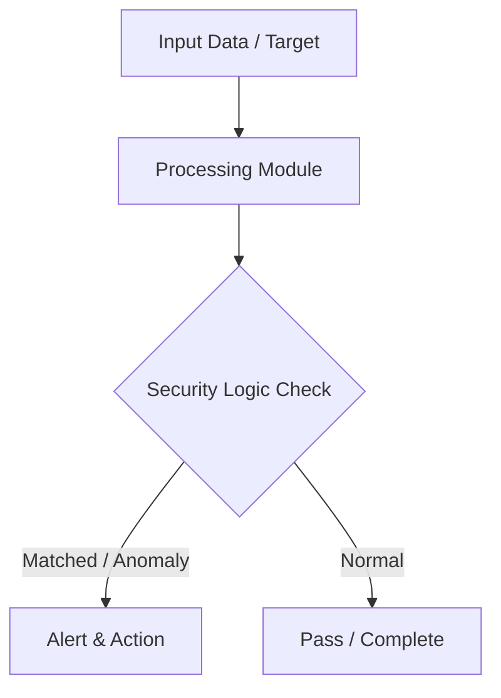

# 009 - Simple Keylogger Detection & Process Monitoring Tool

> **Category**: Basic Cybersecurity Projects | **Difficulty**: ⭐ Basic | **Duration**: 1-2 weeks

---

## Problem Statement and Real World Impact

Real-world applications me yeh problem kafi common hai. Detecting untrusted background processes attempting keyboard hook injections or monitoring active windows.

Jab hum beginner-level cybersecurity practicals ki baat karte hain, toh foundational concepts ko code ke zariye samajhna sabse effective tareeka hota hai. Yeh project ek simple Python script ke zariye is real-world problem ko directly solve karta hai.

---

## Textbook & Paper References

- **Book Reference**: Practical Malware Analysis by Sikorski & Honig (Chapter 11: Malware Behavior & Windows Hooks)
- **Research Paper**: Detecting Spyware and Keyloggers via Behavioral Process Inspection (IEEE Transactions on Information Forensics, 2015)

---

## System Architecture

Link: [[Drawing 2026-07-30 22.31.19.excalidraw#Project Basic-009: 009 - Simple Keylogger Detection & Process Monitoring Tool|Excalidraw Architecture Diagram]]



---

## Technical Implementation Code

Python process monitor utilizing psutil to scan running applications for suspicious API DLL hooks and hidden background workers.

```python
import psutil

def audit_processes():
    print("[*] Auditing running processes for suspicious characteristics...")
    suspicious_keywords = ["keylog", "hook", "spy", "capture", "keyboard"]
    
    for proc in psutil.process_iter(['pid', 'name', 'exe', 'cmdline']):
        try:
            info = proc.info
            name = info['name'].lower()
            cmd = " ".join(info['cmdline']).lower() if info['cmdline'] else ""
            
            for kw in suspicious_keywords:
                if kw in name or kw in cmd:
                    print(f"[!] SUSPICIOUS PROCESS DETECTED: PID {info['pid']} | Name: {info['name']}")
                    print(f"    Path: {info['exe']}")
        except (psutil.NoSuchProcess, psutil.AccessDenied):
            pass

if __name__ == "__main__":
    audit_processes()

```

---

## Expected Results & Outcomes

1. Clear understanding of underlying networking, hashing, or system security mechanics.
2. Functional, lightweight Python script ready to execute in a local lab.
3. Verification of security controls against common real-world misconfigurations.

---

## Legal and Ethical Notice

> [!WARNING] Educational Use Only
> Always run these basic projects in your own local testing environment or authorized laboratory network.

---

## Related Index
- [[00 - Basic Cybersecurity Projects Index]]
