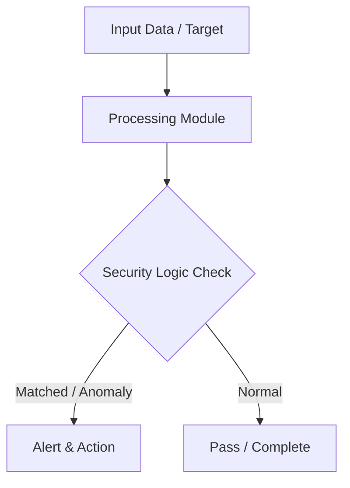

# 009 - Simple Keylogger Detection & Process Monitoring Tool

> **Category**: Basic Cybersecurity Projects | **Difficulty**: ⭐ Basic | **Duration**: 1-2 weeks

---

## Problem Statement and Real World Impact

Malicious software, such as spyware and keyloggers, frequently operates silently in the background, intercepting keystrokes and monitoring active windows to steal passwords and sensitive information. These unauthorized processes often disguise themselves among legitimate system tasks, making them difficult for standard users to identify and terminate.

This project addresses endpoint security by developing a Python-based process monitoring tool. Utilizing the `psutil` library, the script audits all currently running applications and flags suspicious processes based on known malicious keywords and execution paths. It provides a practical introduction to behavioral inspection, malware hunting, and operating system process management.

---

## Textbook & Paper References

- **Book Reference**: Practical Malware Analysis by Sikorski & Honig (Chapter 11: Malware Behavior & Windows Hooks)
- **Research Paper**: Detecting Spyware and Keyloggers via Behavioral Process Inspection (IEEE Transactions on Information Forensics, 2015)

---

## System Architecture

Link: [[Drawing 2026-07-30 22.31.19.excalidraw#Project Basic-009: 009 - Simple Keylogger Detection & Process Monitoring Tool|Excalidraw Architecture Diagram]]



---

## Technical Implementation Code

Python process monitor utilizing psutil to scan running applications for suspicious API DLL hooks and hidden background workers.

```python
import psutil

def audit_processes():
    print("[*] Auditing running processes for suspicious characteristics...")
    suspicious_keywords = ["keylog", "hook", "spy", "capture", "keyboard"]
    
    for proc in psutil.process_iter(['pid', 'name', 'exe', 'cmdline']):
        try:
            info = proc.info
            name = info['name'].lower()
            cmd = " ".join(info['cmdline']).lower() if info['cmdline'] else ""
            
            for kw in suspicious_keywords:
                if kw in name or kw in cmd:
                    print(f"[!] SUSPICIOUS PROCESS DETECTED: PID {info['pid']} | Name: {info['name']}")
                    print(f"    Path: {info['exe']}")
        except (psutil.NoSuchProcess, psutil.AccessDenied):
            pass

if __name__ == "__main__":
    audit_processes()
```

---

## Expected Results & Outcomes

1. A clear understanding of operating system process management and behavioral anomaly detection.
2. A functional Python script capable of actively scanning and identifying suspicious background processes.
3. Practical experience in recognizing potential spyware or keylogger activity within a local environment.

---

## Legal and Ethical Notice

> [!WARNING] Educational Use Only
> Always run these basic projects in your own local testing environment or authorized laboratory network.

---

## Related Index
- [[00 - Basic Cybersecurity Projects Index]]
