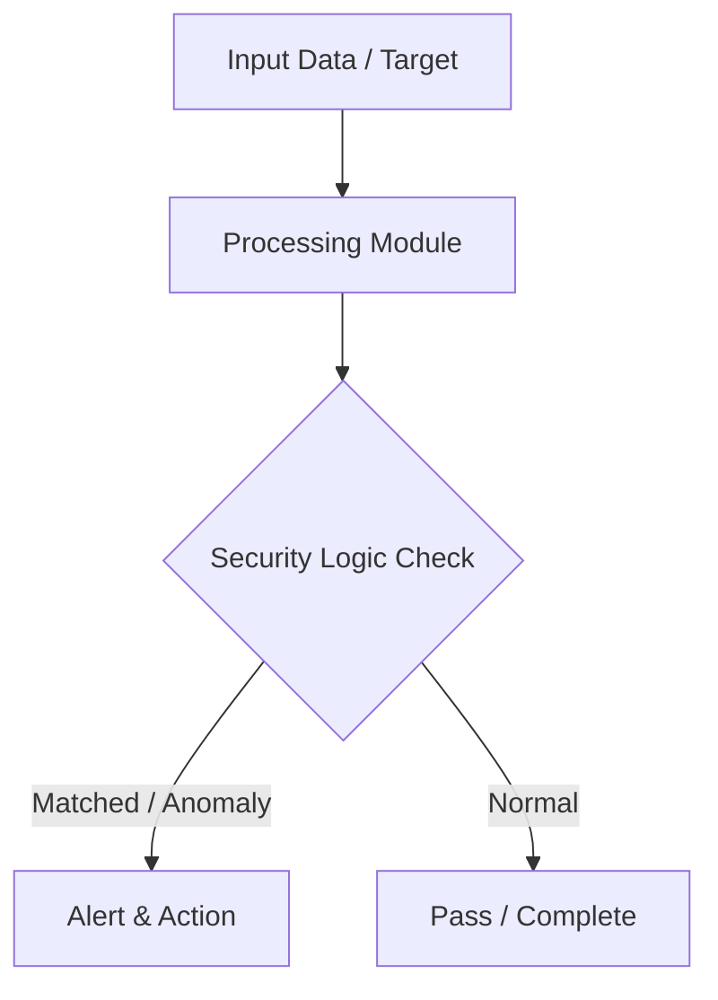

# 010 - Basic SQL Injection Vulnerability Test Script

> **Category**: Basic Cybersecurity Projects | **Difficulty**: ⭐ Basic | **Duration**: 1-2 weeks

---

## Problem Statement and Real World Impact

Many web applications fail to properly sanitize user inputs, leading to SQL Injection (SQLi) vulnerabilities. When search parameters, login forms, or other input fields directly query a database without validation or parameterized queries, attackers can manipulate the input to execute arbitrary SQL commands. This can result in unauthorized data access, modification, or even complete database compromise.

Understanding how SQL injection works at a foundational level is a crucial step for anyone learning practical cybersecurity. By building a basic Python script that tests for SQL injection flaws, you can see exactly how malicious inputs interact with backend databases. This project provides a hands-on approach to identifying unsafe database queries by injecting standard test payloads and analyzing the server's response for database error messages.

---

## Textbook & Paper References

- **Book Reference**: SQL Injection Attacks and Defense by Justin Clarke (Chapter 2: Anatomy of a SQL Injection Attack)
- **Research Paper**: A Automated Testing Methodology for SQL Injection Flaws (ACM SIGSOFT, 2012)

---

## System Architecture

Link: [[Drawing 2026-07-30 22.31.19.excalidraw#Project Basic-010: 010 - Basic SQL Injection Vulnerability Test Script|Excalidraw Architecture Diagram]]



---

## Technical Implementation Code

Python script injecting single quotes and standard SQLi test strings into HTTP request parameters and checking for database error responses.

```python
import requests

sqli_payloads = ["'", "' OR '1'='1", "' OR 1=1 --", "admin' --"]
sql_errors = ["syntax error", "mysql_fetch", "sqlite3", "pg_query", "unclosed quotation mark"]

def test_sqli(url, param_name):
    print(f"[*] Testing parameter '{param_name}' on URL: {url}")
    for payload in sqli_payloads:
        target = f"{url}?{param_name}={payload}"
        try:
            res = requests.get(target, timeout=3.0)
            for err in sql_errors:
                if err in res.text.lower():
                    print(f"[!] VULNERABILITY DETECTED with payload: {payload}")
                    print(f"    Database Error Snippet Found: {err}")
                    return True
        except requests.RequestException:
            pass
    print("[-] Parameter appears resilient to basic SQLi payloads.")
    return False

if __name__ == "__main__":
    test_sqli("http://127.0.0.1/search.php", "query")

```

---

## Expected Results & Outcomes

1. A clear understanding of how SQL injection payloads manipulate backend database queries.
2. A functional, lightweight Python script that can detect basic SQLi vulnerabilities in a controlled local lab environment.
3. The ability to identify poor input validation practices by analyzing database error responses.

---

## Legal and Ethical Notice

> [!WARNING] Educational Use Only
> Always run these basic projects in your own local testing environment or authorized laboratory network.

---

## Related Index
- [[00 - Basic Cybersecurity Projects Index]]
