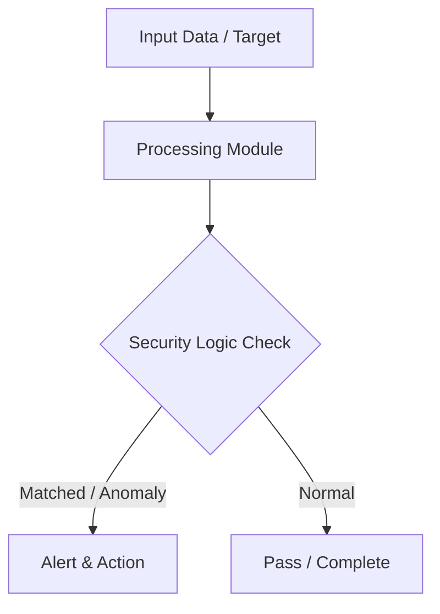

# 011 - Simple Encrypted Password Manager CLI Tool

> **Category**: Basic Cybersecurity Projects | **Difficulty**: ⭐ Basic | **Duration**: 1-2 weeks

---

## Problem Statement and Real World Impact

Real-world applications me yeh problem kafi common hai. Safely storing personal user passwords in a single encrypted local vault rather than reusing weak passwords across sites.

Jab hum beginner-level cybersecurity practicals ki baat karte hain, toh foundational concepts ko code ke zariye samajhna sabse effective tareeka hota hai. Yeh project ek simple Python script ke zariye is real-world problem ko directly solve karta hai.

---

## Textbook & Paper References

- **Book Reference**: Applied Cryptography by Bruce Schneier (Chapter 14: Symmetric Ciphers & Password Vault Design)
- **Research Paper**: Security Analysis of Consumer Password Manager Architectures (IEEE Security & Privacy, 2014)

---

## System Architecture

Link: [[Drawing 2026-07-30 22.31.19.excalidraw#Project Basic-011: 011 - Simple Encrypted Password Manager CLI Tool|Excalidraw Architecture Diagram]]



---

## Technical Implementation Code

Python CLI tool encrypting password entries using Fernet (AES-128-CBC + HMAC) derived from a master password via PBKDF2.

```python
import base64
import json
import os
from cryptography.hazmat.primitives.kdf.pbkdf2 import PBKDF2HMAC
from cryptography.hazmat.primitives import hashes
from cryptography.fernet import Fernet

def derive_key(master_password, salt):
    kdf = PBKDF2HMAC(
        algorithm=hashes.SHA256(),
        length=32,
        salt=salt,
        iterations=100000,
    )
    return base64.urlsafe_b64encode(kdf.derive(master_password.encode()))

def save_vault(vault_data, master_password, filename="vault.enc"):
    salt = os.urandom(16)
    key = derive_key(master_password, salt)
    fernet = Fernet(key)
    encrypted = fernet.encrypt(json.dumps(vault_data).encode())
    
    with open(filename, "wb") as f:
        f.write(salt + encrypted)
    print("[+] Vault saved successfully.")

def load_vault(master_password, filename="vault.enc"):
    if not os.path.exists(filename): return {}
    with open(filename, "rb") as f:
        data = f.read()
    salt = data[:16]
    encrypted = data[16:]
    key = derive_key(master_password, salt)
    fernet = Fernet(key)
    try:
        decrypted = fernet.decrypt(encrypted)
        return json.loads(decrypted.decode())
    except:
        print("[-] Incorrect Master Password!")
        return None

if __name__ == "__main__":
    print("[*] Encrypted Password Manager Initialization Ready.")

```

---

## Expected Results & Outcomes

1. Clear understanding of underlying networking, hashing, or system security mechanics.
2. Functional, lightweight Python script ready to execute in a local lab.
3. Verification of security controls against common real-world misconfigurations.

---

## Legal and Ethical Notice

> [!WARNING] Educational Use Only
> Always run these basic projects in your own local testing environment or authorized laboratory network.

---

## Related Index
- [[00 - Basic Cybersecurity Projects Index]]
