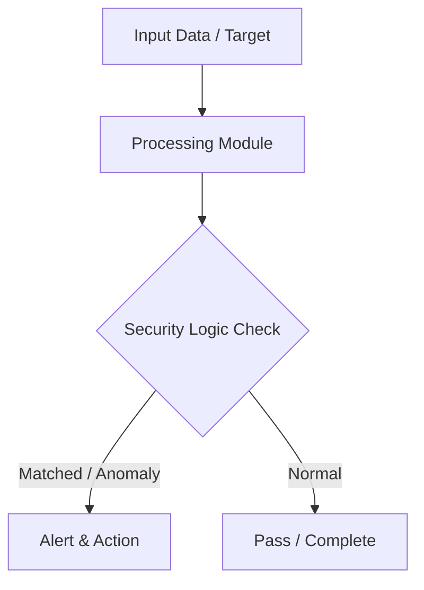

# 012 - Basic Log File Anomaly Scanner using Regex

> **Category**: Basic Cybersecurity Projects | **Difficulty**: ⭐ Basic | **Duration**: 1-2 weeks

---

## Problem Statement and Real World Impact

Web servers constantly generate access logs that record every interaction, including malicious activities like brute-force login attempts, directory traversal, and exploit payloads. However, manually reviewing these massive log files is impractical. Security teams need automated ways to scan these logs to quickly detect anomalies and identify potential attacks in progress.

This project focuses on building a foundational log analysis tool using Python and regular expressions (Regex). By writing a script that automatically parses Nginx or Apache access logs, you will learn how to flag suspicious patterns such as bursts of 401/403 HTTP status codes (indicating brute-force attacks) or malicious GET parameters (like SQLi or XSS payloads). This is a core skill for defensive security monitoring and incident response.

---

## Textbook & Paper References

- **Book Reference**: Logging and Log Management by Anton Chuvakin (Chapter 5: Log Parsing & Pattern Detection)
- **Research Paper**: Automated Analysis of Web Server Access Logs for Security Auditing (IEEE Security & Privacy, 2016)

---

## System Architecture

Link: [[Drawing 2026-07-30 22.31.19.excalidraw#Project Basic-012: 012 - Basic Log File Anomaly Scanner using Regex|Excalidraw Architecture Diagram]]



---

## Technical Implementation Code

Python log scanner evaluating Nginx/Apache log files using regular expressions to flag 401/403 status bursts and malicious GET parameters.

```python
import re
from collections import defaultdict

log_pattern = re.compile(r'(\d+\.\d+\.\d+\.\d+) - - \[(.*?)\] "(.*?)" (\d{3})')

def analyze_logs(log_filepath):
    failed_logins = defaultdict(int)
    suspicious_queries = []
    
    with open(log_filepath, "r") as f:
        for line in f:
            match = log_pattern.search(line)
            if match:
                ip, timestamp, request, status = match.groups()
                if status in ["401", "403"]:
                    failed_logins[ip] += 1
                if any(x in request for x in ["../", "' OR ", "SELECT ", "<script>"]):
                    suspicious_queries.append((ip, request))
                    
    print("=== SUSPICIOUS IP SUMMARY (Failed Attempts > 5) ===")
    for ip, count in failed_logins.items():
        if count > 5:
            print(f"[!] IP: {ip} | Failed Attempts: {count}")
            
    print("\n=== POTENTIAL EXPLOIT PAYLOAD LOGS ===")
    for ip, req in suspicious_queries:
        print(f"[!] IP: {ip} | Request: {req}")

if __name__ == "__main__":
    print("[*] Log Scanner Module Loaded.")

```

---

## Expected Results & Outcomes

1. Proficiency in parsing structured web server logs and extracting actionable security metrics.
2. A functional Python script that leverages regular expressions to automatically flag malicious payloads and brute-force attempts.
3. A foundational understanding of how SIEM (Security Information and Event Management) tools process and analyze log data.

---

## Legal and Ethical Notice

> [!WARNING] Educational Use Only
> Always run these basic projects in your own local testing environment or authorized laboratory network.

---

## Related Index
- [[00 - Basic Cybersecurity Projects Index]]
