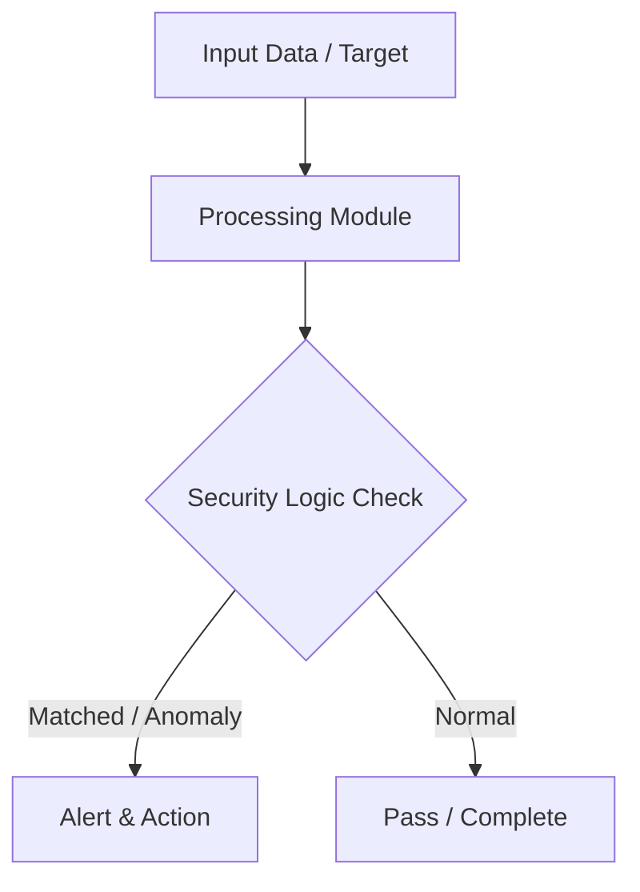

# 013 - Simple DNS Lookup & Subdomain Finder Tool

> **Category**: Basic Cybersecurity Projects | **Difficulty**: ⭐ Basic | **Duration**: 1-2 weeks

---

## Problem Statement and Real World Impact

Real-world applications me yeh problem kafi common hai. Mapping out an organization's public subdomains to understand its external attack surface.

Jab hum beginner-level cybersecurity practicals ki baat karte hain, toh foundational concepts ko code ke zariye samajhna sabse effective tareeka hota hai. Yeh project ek simple Python script ke zariye is real-world problem ko directly solve karta hai.

---

## Textbook & Paper References

- **Book Reference**: Computer Networking: A Top-Down Approach by Kurose & Ross (Chapter 2: DNS Specification)
- **Research Paper**: Empirical Analysis of Subdomain Enumeration and DNS Security (ACM SIGCOMM, 2017)

---

## System Architecture

Link: [[Drawing 2026-07-30 22.31.19.excalidraw#Project Basic-013: 013 - Simple DNS Lookup & Subdomain Finder Tool|Excalidraw Architecture Diagram]]



---

## Technical Implementation Code

Python DNS query tool attempting A record lookups for a target domain using a list of common subdomain prefixes.

```python
import socket

subdomains = ["www", "mail", "admin", "dev", "staging", "api", "test", "portal", "vpn"]

def find_subdomains(target_domain):
    print(f"[*] Enumerating subdomains for: {target_domain}")
    found = []
    for sub in subdomains:
        fqdn = f"{sub}.{target_domain}"
        try:
            ip = socket.gethostbyname(fqdn)
            print(f"[+] Active Subdomain: {fqdn} -> {ip}")
            found.append((fqdn, ip))
        except socket.gaierror:
            pass
    print(f"[*] Discovery complete. Found {len(found)} active subdomains.")
    return found

if __name__ == "__main__":
    find_subdomains("google.com")

```

---

## Expected Results & Outcomes

1. Clear understanding of underlying networking, hashing, or system security mechanics.
2. Functional, lightweight Python script ready to execute in a local lab.
3. Verification of security controls against common real-world misconfigurations.

---

## Legal and Ethical Notice

> [!WARNING] Educational Use Only
> Always run these basic projects in your own local testing environment or authorized laboratory network.

---

## Related Index
- [[00 - Basic Cybersecurity Projects Index]]
