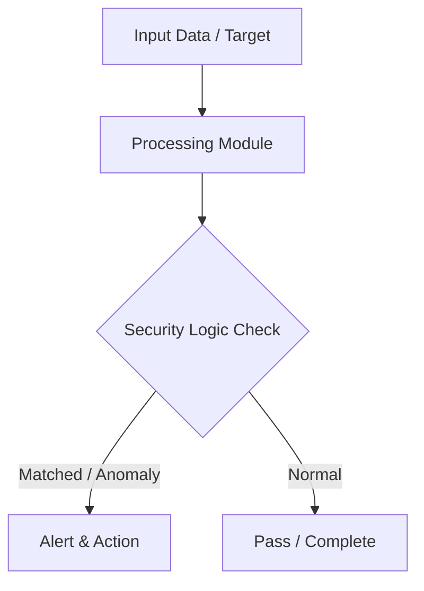

# 013 - Simple DNS Lookup & Subdomain Finder Tool

> **Category**: Basic Cybersecurity Projects | **Difficulty**: ⭐ Basic | **Duration**: 1-2 weeks

---

## Problem Statement and Real World Impact

During the reconnaissance phase of a security assessment, understanding an organization's external attack surface is critical. Companies often host internal tools, staging environments, and legacy applications on unlinked subdomains. If these subdomains are exposed to the internet, they can provide attackers with an easy entry point, as they are frequently less secure or poorly maintained compared to the main website.

To map out these hidden assets, cybersecurity professionals use subdomain enumeration tools. This project involves creating a simple Python script that automates DNS lookups to discover active subdomains. By querying a target domain against a predefined list of common subdomain prefixes, you will learn how DNS resolution works and how attackers or penetration testers gather intelligence about a target's infrastructure.

---

## Textbook & Paper References

- **Book Reference**: Computer Networking: A Top-Down Approach by Kurose & Ross (Chapter 2: DNS Specification)
- **Research Paper**: Empirical Analysis of Subdomain Enumeration and DNS Security (ACM SIGCOMM, 2017)

---

## System Architecture

Link: [[Drawing 2026-07-30 22.31.19.excalidraw#Project Basic-013: 013 - Simple DNS Lookup & Subdomain Finder Tool|Excalidraw Architecture Diagram]]



---

## Technical Implementation Code

Python DNS query tool attempting A record lookups for a target domain using a list of common subdomain prefixes.

```python
import socket

subdomains = ["www", "mail", "admin", "dev", "staging", "api", "test", "portal", "vpn"]

def find_subdomains(target_domain):
    print(f"[*] Enumerating subdomains for: {target_domain}")
    found = []
    for sub in subdomains:
        fqdn = f"{sub}.{target_domain}"
        try:
            ip = socket.gethostbyname(fqdn)
            print(f"[+] Active Subdomain: {fqdn} -> {ip}")
            found.append((fqdn, ip))
        except socket.gaierror:
            pass
    print(f"[*] Discovery complete. Found {len(found)} active subdomains.")
    return found

if __name__ == "__main__":
    find_subdomains("google.com")

```

---

## Expected Results & Outcomes

1. A practical understanding of the Domain Name System (DNS) and how A records map hostnames to IP addresses.
2. A working Python script capable of automating subdomain enumeration to uncover hidden organizational assets.
3. Insight into reconnaissance techniques and external attack surface management.

---

## Legal and Ethical Notice

> [!WARNING] Educational Use Only
> Always run these basic projects in your own local testing environment or authorized laboratory network.

---

## Related Index
- [[00 - Basic Cybersecurity Projects Index]]
