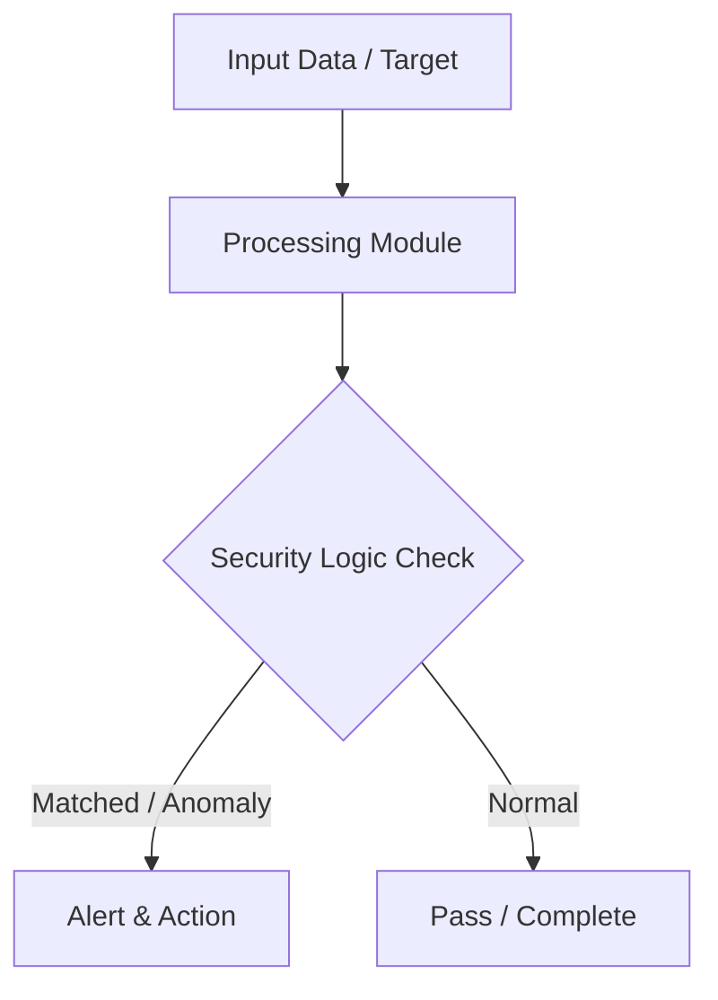

# 014 - Basic Cross-Site Scripting (XSS) Reflected Scanner

> **Category**: Basic Cybersecurity Projects | **Difficulty**: ⭐ Basic | **Duration**: 1-2 weeks

---

## Problem Statement and Real World Impact

Cross-Site Scripting (XSS) remains a prevalent vulnerability in modern web applications. Reflected XSS occurs when an application receives input in an HTTP request and immediately includes that unescaped input in the HTML response. If an attacker tricks a user into clicking a crafted link, the victim's browser will execute the malicious JavaScript, potentially leading to session hijacking, defacement, or data theft.

Understanding how to detect Reflected XSS is essential for securing web applications. This project demonstrates how to build a basic automated scanner using Python. The script injects benign HTML and JavaScript probe tags into URL parameters and inspects the HTTP response. If the payload is echoed back without proper HTML entity encoding, the script flags the parameter as vulnerable, providing a clear demonstration of input validation failures.

---

## Textbook & Paper References

- **Book Reference**: XSS Attacks: Cross Site Scripting Exploits and Defense by Jeremiah Grossman (Chapter 3: Reflected XSS)
- **Research Paper**: A Systematic Survey of XSS Detection and Sanitization Techniques (ACM Computing Surveys, 2019)

---

## System Architecture

Link: [[Drawing 2026-07-30 22.31.19.excalidraw#Project Basic-014: 014 - Basic Cross-Site Scripting (XSS) Reflected Scanner|Excalidraw Architecture Diagram]]



---

## Technical Implementation Code

Python script issuing HTTP requests with benign HTML probe tags and checking if the response body reflects the tags without encoding.

```python
import requests

probe_payload = "<script>alert('XSS_TEST')</script>"

def scan_xss(target_url, param_name):
    print(f"[*] Scanning for Reflected XSS on parameter '{param_name}'...")
    params = {param_name: probe_payload}
    try:
        res = requests.get(target_url, params=params, timeout=3.0)
        if probe_payload in res.text:
            print(f"[!] REFLECTED XSS VULNERABILITY FOUND!")
            print(f"    Payload was echoed back without HTML entity encoding.")
            return True
        else:
            print("[-] Input appears sanitized or encoded correctly.")
    except requests.RequestException as e:
        print(f"[-] Request failed: {e}")
    return False

if __name__ == "__main__":
    scan_xss("http://127.0.0.1/profile.php", "name")

```

---

## Expected Results & Outcomes

1. A solid understanding of how Reflected XSS vulnerabilities occur due to improper output encoding.
2. A functional Python script that automates the detection of unescaped input reflection in web parameters.
3. The ability to practically verify if a web application correctly sanitizes user-supplied data before rendering it in the browser.

---

## Legal and Ethical Notice

> [!WARNING] Educational Use Only
> Always run these basic projects in your own local testing environment or authorized laboratory network.

---

## Related Index
- [[00 - Basic Cybersecurity Projects Index]]
