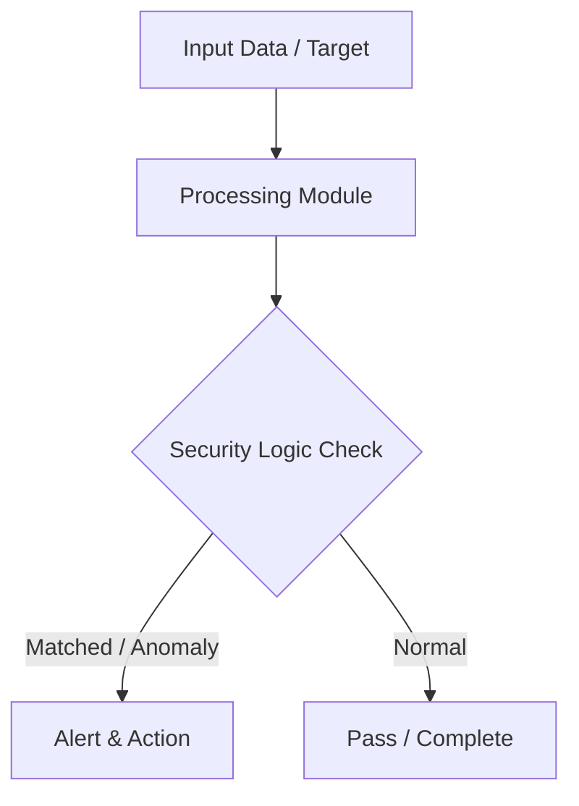

# 014 - Basic Cross-Site Scripting (XSS) Reflected Scanner

> **Category**: Basic Cybersecurity Projects | **Difficulty**: ⭐ Basic | **Duration**: 1-2 weeks

---

## Problem Statement and Real World Impact

Real-world applications me yeh problem kafi common hai. Testing whether web application inputs echo unescaped HTML/JavaScript tags back into the HTTP response.

Jab hum beginner-level cybersecurity practicals ki baat karte hain, toh foundational concepts ko code ke zariye samajhna sabse effective tareeka hota hai. Yeh project ek simple Python script ke zariye is real-world problem ko directly solve karta hai.

---

## Textbook & Paper References

- **Book Reference**: XSS Attacks: Cross Site Scripting Exploits and Defense by Jeremiah Grossman (Chapter 3: Reflected XSS)
- **Research Paper**: A Systematic Survey of XSS Detection and Sanitization Techniques (ACM Computing Surveys, 2019)

---

## System Architecture

Link: [[Drawing 2026-07-30 22.31.19.excalidraw#Project Basic-014: 014 - Basic Cross-Site Scripting (XSS) Reflected Scanner|Excalidraw Architecture Diagram]]



---

## Technical Implementation Code

Python script issuing HTTP requests with benign HTML probe tags and checking if the response body reflects the tags without encoding.

```python
import requests

probe_payload = "<script>alert('XSS_TEST')</script>"

def scan_xss(target_url, param_name):
    print(f"[*] Scanning for Reflected XSS on parameter '{param_name}'...")
    params = {param_name: probe_payload}
    try:
        res = requests.get(target_url, params=params, timeout=3.0)
        if probe_payload in res.text:
            print(f"[!] REFLECTED XSS VULNERABILITY FOUND!")
            print(f"    Payload was echoed back without HTML entity encoding.")
            return True
        else:
            print("[-] Input appears sanitized or encoded correctly.")
    except requests.RequestException as e:
        print(f"[-] Request failed: {e}")
    return False

if __name__ == "__main__":
    scan_xss("http://127.0.0.1/profile.php", "name")

```

---

## Expected Results & Outcomes

1. Clear understanding of underlying networking, hashing, or system security mechanics.
2. Functional, lightweight Python script ready to execute in a local lab.
3. Verification of security controls against common real-world misconfigurations.

---

## Legal and Ethical Notice

> [!WARNING] Educational Use Only
> Always run these basic projects in your own local testing environment or authorized laboratory network.

---

## Related Index
- [[00 - Basic Cybersecurity Projects Index]]
