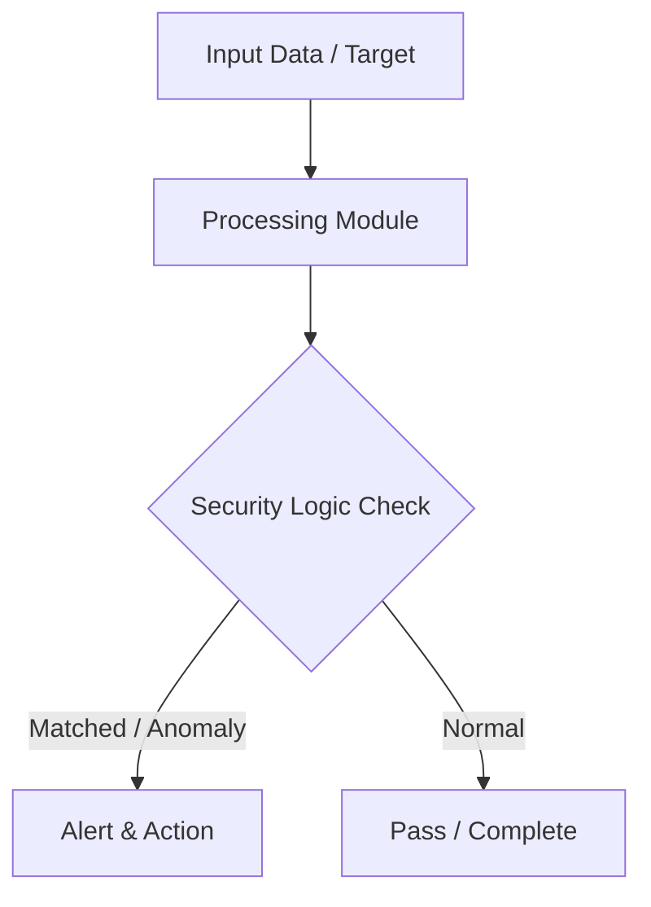

# 015 - Simple System Wi-Fi Saved Passwords Extractor

> **Category**: Basic Cybersecurity Projects | **Difficulty**: ⭐ Basic | **Duration**: 1-2 weeks

---

## Problem Statement and Real World Impact

Real-world applications me yeh problem kafi common hai. Auditing stored wireless network profiles and verifying if weak pre-shared keys are stored locally.

Jab hum beginner-level cybersecurity practicals ki baat karte hain, toh foundational concepts ko code ke zariye samajhna sabse effective tareeka hota hai. Yeh project ek simple Python script ke zariye is real-world problem ko directly solve karta hai.

---

## Textbook & Paper References

- **Book Reference**: IEEE 802.11i Standard Architecture (Wireless LAN Security & WPA2-PSK Storage Mechanics)
- **Research Paper**: Evaluating Local Credential Exposure on Desktop Operating Systems (IEEE Security & Privacy, 2016)

---

## System Architecture

Link: [[Drawing 2026-07-30 22.31.19.excalidraw#Project Basic-015: 015 - Simple System Wi-Fi Saved Passwords Extractor|Excalidraw Architecture Diagram]]



---

## Technical Implementation Code

Python script using subprocess to execute netsh commands on Windows and list saved Wi-Fi SSIDs and cleartext keys.

```python
import subprocess
import re

def get_wifi_passwords():
    print("[*] Auditing saved Wi-Fi profiles on local machine...")
    try:
        output = subprocess.check_output(["netsh", "wlan", "show", "profiles"]).decode('utf-8', errors='ignore')
        profiles = re.findall(r"All User Profile\s*:\s*(.*)", output)
        
        for profile in profiles:
            profile = profile.strip().rstripl('
')
            try:
                results = subprocess.check_output(["netsh", "wlan", "show", "profile", profile, "key=clear"]).decode('utf-8', errors='ignore')
                key_match = re.search(r"Key Content\s*:\s*(.*)", results)
                password = key_match.group(1).strip() if key_match else "None (Open / Enterprise)"
                print(f"[+] SSID: {profile:<25} | Password: {password}")
            except:
                pass
    except Exception as e:
        print(f"[-] Command execution failed: {e}")

if __name__ == "__main__":
    get_wifi_passwords()

```

---

## Expected Results & Outcomes

1. Clear understanding of underlying networking, hashing, or system security mechanics.
2. Functional, lightweight Python script ready to execute in a local lab.
3. Verification of security controls against common real-world misconfigurations.

---

## Legal and Ethical Notice

> [!WARNING] Educational Use Only
> Always run these basic projects in your own local testing environment or authorized laboratory network.

---

## Related Index
- [[00 - Basic Cybersecurity Projects Index]]
