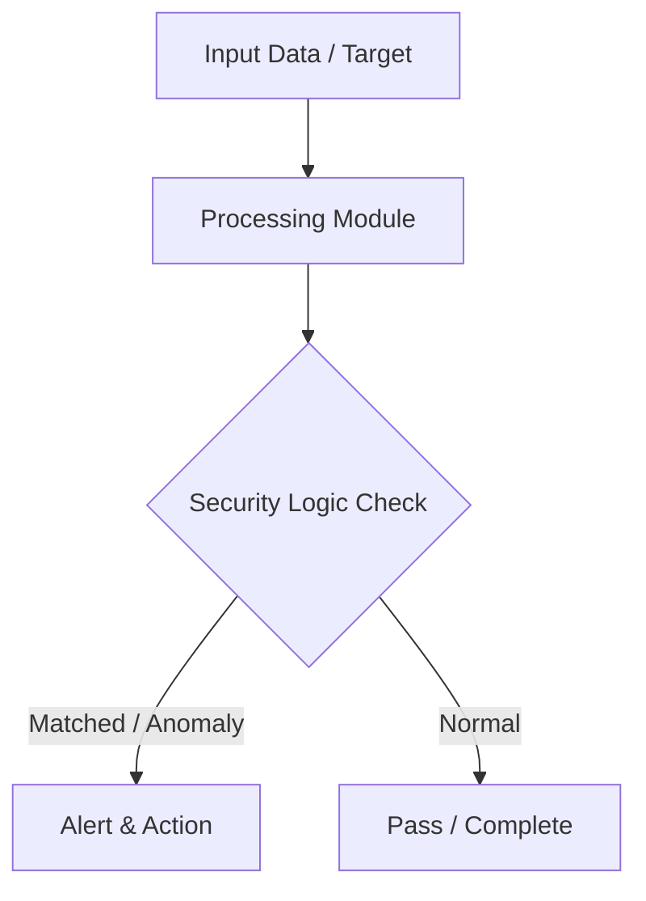

# 015 - Simple System Wi-Fi Saved Passwords Extractor

> **Category**: Basic Cybersecurity Projects | **Difficulty**: ⭐ Basic | **Duration**: 1-2 weeks

---

## Problem Statement and Real World Impact

In corporate and personal environments, operating systems often store wireless network credentials in plain text or easily reversible formats for convenience. This common behavior presents a significant security risk, as any malicious actor or unauthorized application with local access can quickly extract these saved passwords. Auditing local Wi-Fi configuration credentials is a critical step in assessing an endpoint's security posture and identifying potential exposure of weak pre-shared keys.

For cybersecurity professionals and system administrators, understanding how these credentials are stored and extracted is essential. This project demonstrates how to programmatically interact with the system's network shell to extract saved wireless profiles and their corresponding cleartext passwords, highlighting the importance of securing local device access and utilizing enterprise-grade authentication mechanisms.

---

## Textbook & Paper References

- **Book Reference**: IEEE 802.11i Standard Architecture (Wireless LAN Security & WPA2-PSK Storage Mechanics)
- **Research Paper**: Evaluating Local Credential Exposure on Desktop Operating Systems (IEEE Security & Privacy, 2016)

---

## System Architecture

Link: [[Drawing 2026-07-30 22.31.19.excalidraw#Project Basic-015: 015 - Simple System Wi-Fi Saved Passwords Extractor|Excalidraw Architecture Diagram]]



---

## Technical Implementation Code

Python script using subprocess to execute netsh commands on Windows and list saved Wi-Fi SSIDs and cleartext keys.

```python
import subprocess
import re

def get_wifi_passwords():
    print("[*] Auditing saved Wi-Fi profiles on local machine...")
    try:
        output = subprocess.check_output(["netsh", "wlan", "show", "profiles"]).decode('utf-8', errors='ignore')
        profiles = re.findall(r"All User Profile\s*:\s*(.*)", output)
        
        for profile in profiles:
            profile = profile.strip().rstrip('\r\n')
            try:
                results = subprocess.check_output(["netsh", "wlan", "show", "profile", profile, "key=clear"]).decode('utf-8', errors='ignore')
                key_match = re.search(r"Key Content\s*:\s*(.*)", results)
                password = key_match.group(1).strip() if key_match else "None (Open / Enterprise)"
                print(f"[+] SSID: {profile:<25} | Password: {password}")
            except:
                pass
    except Exception as e:
        print(f"[-] Command execution failed: {e}")

if __name__ == "__main__":
    get_wifi_passwords()
```

---

## Expected Results & Outcomes

1. A clear understanding of how Windows operating systems locally store and manage wireless network profiles and pre-shared keys.
2. A functional, lightweight Python script capable of querying the system network shell to extract and display saved Wi-Fi SSIDs alongside their cleartext passwords.
3. Practical insight into local credential exposure risks, emphasizing the need for robust endpoint security and enterprise authentication (like 802.1X).

---

## Legal and Ethical Notice

> [!WARNING] Educational Use Only
> Always run these basic projects in your own local testing environment or authorized laboratory network.

---

## Related Index
- [[00 - Basic Cybersecurity Projects Index]]
