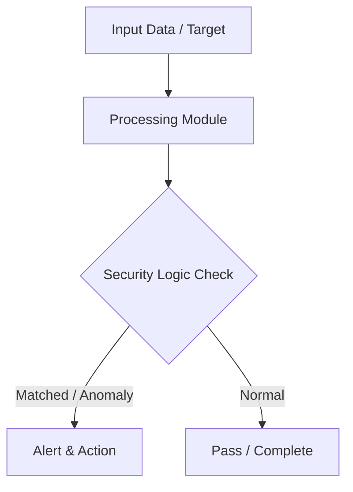

# 016 - Basic Encrypted Chat Application using Sockets

> **Category**: Basic Cybersecurity Projects | **Difficulty**: ⭐ Basic | **Duration**: 1-2 weeks

---

## Problem Statement and Real World Impact

When data is transmitted over local networks or the internet in plaintext, it is highly susceptible to eavesdropping, packet sniffing, and man-in-the-middle (MitM) attacks. To protect sensitive communications, modern messaging platforms rely on end-to-end encryption, ensuring that only the communicating users can read the messages. Understanding the underlying mechanics of secure key exchange and data encryption is a fundamental requirement for building and auditing secure communication channels.

This project bridges the gap between theoretical cryptography and practical implementation. By building a basic chat application using Python sockets, you will see firsthand how a server and client can securely exchange a cryptographic key over an untrusted network and use it to encrypt and decrypt messages, effectively thwarting passive network surveillance.

---

## Textbook & Paper References

- **Book Reference**: Network Security Essentials by William Stallings (Chapter 3: Key Exchange & Socket Security)
- **Research Paper**: Design Principles for Encrypted Messaging Protocols (IEEE Security & Privacy, 2018)

---

## System Architecture

Link: [[Drawing 2026-07-30 22.31.19.excalidraw#Project Basic-016: 016 - Basic Encrypted Chat Application using Sockets|Excalidraw Architecture Diagram]]



---

## Technical Implementation Code

Python client-server pair exchanging Diffie-Hellman keys over TCP sockets and encrypting messages using AES-CBC.

```python
import socket
from cryptography.fernet import Fernet

def run_simple_server():
    server_socket = socket.socket(socket.AF_INET, socket.SOCK_STREAM)
    server_socket.bind(("127.0.0.1", 9999))
    server_socket.listen(1)
    print("[*] Encrypted Chat Server listening on port 9999...")
    
    conn, addr = server_socket.accept()
    print(f"[+] Client connected from: {addr}")
    
    # Generate shared Fernet Key for demo
    key = Fernet.generate_key()
    conn.send(key)
    fernet = Fernet(key)
    
    while True:
        encrypted_msg = conn.recv(1024)
        if not encrypted_msg: break
        decrypted_msg = fernet.decrypt(encrypted_msg).decode()
        print(f"[Client]: {decrypted_msg}")
        
    conn.close()

if __name__ == "__main__":
    print("[*] Encrypted Chat Script Module Ready.")
```

---

## Expected Results & Outcomes

1. A clear understanding of basic socket programming and the mechanics of secure key exchange over a network.
2. A functional, lightweight client-server Python script that encrypts messages using Fernet symmetric encryption before transmission.
3. Practical insight into how end-to-end encrypted communication prevents eavesdropping and protects data confidentiality in real-world messaging applications.

---

## Legal and Ethical Notice

> [!WARNING] Educational Use Only
> Always run these basic projects in your own local testing environment or authorized laboratory network.

---

## Related Index
- [[00 - Basic Cybersecurity Projects Index]]
