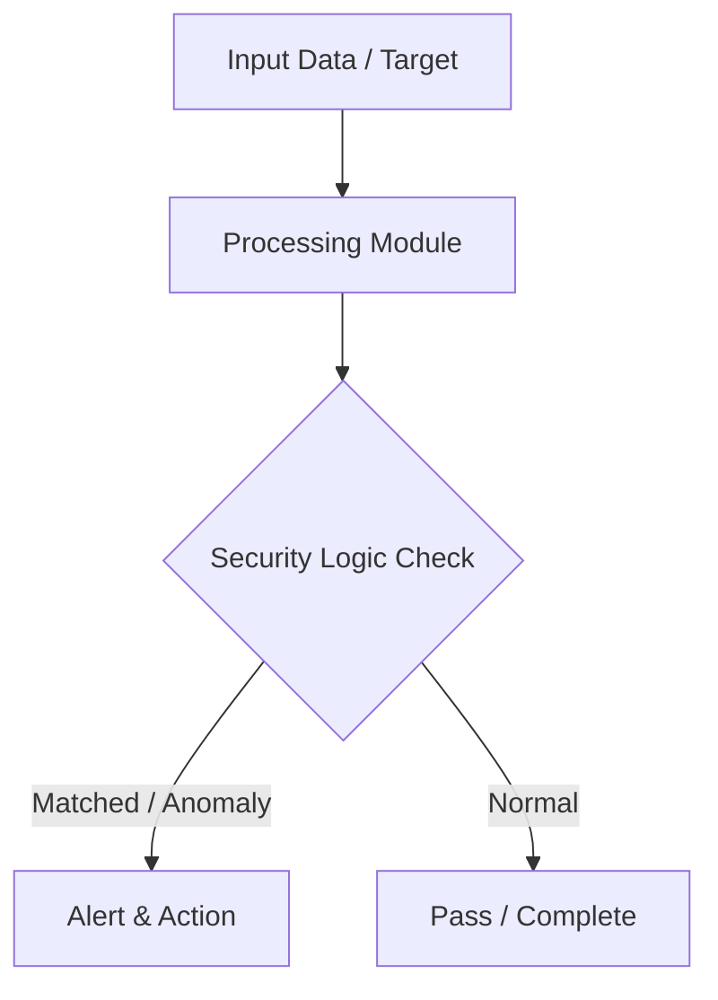

# 017 - Simple HTTP Security Headers Checker

> **Category**: Basic Cybersecurity Projects | **Difficulty**: ⭐ Basic | **Duration**: 1-2 weeks

---

## Problem Statement and Real World Impact

Real-world applications me yeh problem kafi common hai. Verifying if a target web server implements modern security headers like HSTS, CSP, X-Frame-Options, and X-Content-Type-Options.

Jab hum beginner-level cybersecurity practicals ki baat karte hain, toh foundational concepts ko code ke zariye samajhna sabse effective tareeka hota hai. Yeh project ek simple Python script ke zariye is real-world problem ko directly solve karta hai.

---

## Textbook & Paper References

- **Book Reference**: OWASP Secure Headers Project (Implementation & Hardening Guidelines for Web Applications)
- **Research Paper**: Empirical Analysis of HTTP Security Headers Deployment Across Top Web Domains (ACM SIGCOMM, 2018)

---

## System Architecture

Link: [[Drawing 2026-07-30 22.31.19.excalidraw#Project Basic-017: 017 - Simple HTTP Security Headers Checker|Excalidraw Architecture Diagram]]



---

## Technical Implementation Code

Python script inspecting HTTP response headers of a web domain and reporting missing defensive security headers.

```python
import requests

recommended_headers = {
    "Strict-Transport-Security": "Enforces HTTPS connections (HSTS)",
    "Content-Security-Policy": "Mitigates XSS and data injection attacks",
    "X-Frame-Options": "Prevents Clickjacking attacks in iframes",
    "X-Content-Type-Options": "Prevents MIME-sniffing exploits",
    "Referrer-Policy": "Controls referrer information sent in headers"
}

def check_headers(url):
    print(f"[*] Checking HTTP Security Headers for: {url}")
    try:
        res = requests.get(url, timeout=4.0)
        headers = res.headers
        
        print("
=== HEADER AUDIT REPORT ===")
        for header, description in recommended_headers.items():
            if header in headers:
                print(f"[+] PRESENT  : {header:<28} | Value: {headers[header][:40]}...")
            else:
                print(f"[-] MISSING  : {header:<28} | Purpose: {description}")
    except requests.RequestException as e:
        print(f"[-] Failed to fetch URL: {e}")

if __name__ == "__main__":
    check_headers("https://example.com")

```

---

## Expected Results & Outcomes

1. Clear understanding of underlying networking, hashing, or system security mechanics.
2. Functional, lightweight Python script ready to execute in a local lab.
3. Verification of security controls against common real-world misconfigurations.

---

## Legal and Ethical Notice

> [!WARNING] Educational Use Only
> Always run these basic projects in your own local testing environment or authorized laboratory network.

---

## Related Index
- [[00 - Basic Cybersecurity Projects Index]]
