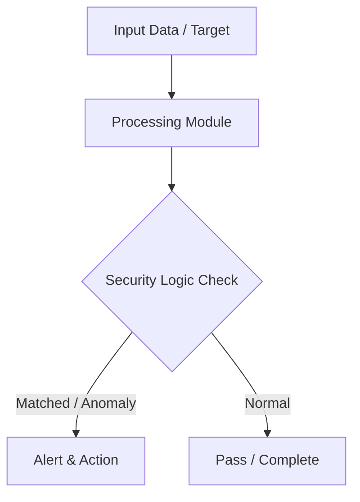

# 017 - Simple HTTP Security Headers Checker

> **Category**: Basic Cybersecurity Projects | **Difficulty**: ⭐ Basic | **Duration**: 1-2 weeks

---

## Problem Statement and Real World Impact

Web browsers rely heavily on HTTP security headers provided by the server to enforce security policies on the client side. When web applications fail to implement modern security headers like HSTS, CSP, and X-Frame-Options, they leave users vulnerable to a wide range of client-side attacks, including Cross-Site Scripting (XSS), clickjacking, and MIME-sniffing exploits. Identifying these missing headers is a critical first step in securing web infrastructure and protecting end-users.

This project focuses on automating the assessment of web application security posturing. By developing a Python script to request and parse HTTP response headers, you will learn how to audit a web server's configuration, verify the presence of essential defensive mechanisms, and map missing headers to the specific real-world vulnerabilities they are designed to prevent.

---

## Textbook & Paper References

- **Book Reference**: OWASP Secure Headers Project (Implementation & Hardening Guidelines for Web Applications)
- **Research Paper**: Empirical Analysis of HTTP Security Headers Deployment Across Top Web Domains (ACM SIGCOMM, 2018)

---

## System Architecture

Link: [[Drawing 2026-07-30 22.31.19.excalidraw#Project Basic-017: 017 - Simple HTTP Security Headers Checker|Excalidraw Architecture Diagram]]



---

## Technical Implementation Code

Python script inspecting HTTP response headers of a web domain and reporting missing defensive security headers.

```python
import requests

recommended_headers = {
    "Strict-Transport-Security": "Enforces HTTPS connections (HSTS)",
    "Content-Security-Policy": "Mitigates XSS and data injection attacks",
    "X-Frame-Options": "Prevents Clickjacking attacks in iframes",
    "X-Content-Type-Options": "Prevents MIME-sniffing exploits",
    "Referrer-Policy": "Controls referrer information sent in headers"
}

def check_headers(url):
    print(f"[*] Checking HTTP Security Headers for: {url}")
    try:
        res = requests.get(url, timeout=4.0)
        headers = res.headers
        
        print("\n=== HEADER AUDIT REPORT ===")
        for header, description in recommended_headers.items():
            if header in headers:
                print(f"[+] PRESENT  : {header:<28} | Value: {headers[header][:40]}...")
            else:
                print(f"[-] MISSING  : {header:<28} | Purpose: {description}")
    except requests.RequestException as e:
        print(f"[-] Failed to fetch URL: {e}")

if __name__ == "__main__":
    check_headers("https://example.com")
```

---

## Expected Results & Outcomes

1. A clear understanding of HTTP response headers and their specific roles in mitigating client-side web vulnerabilities.
2. A functional, lightweight Python script that automatically audits a target URL and generates a report of present and missing security headers.
3. Practical insight into web server hardening and how simple configuration changes can drastically reduce the attack surface of a web application.

---

## Legal and Ethical Notice

> [!WARNING] Educational Use Only
> Always run these basic projects in your own local testing environment or authorized laboratory network.

---

## Related Index
- [[00 - Basic Cybersecurity Projects Index]]
