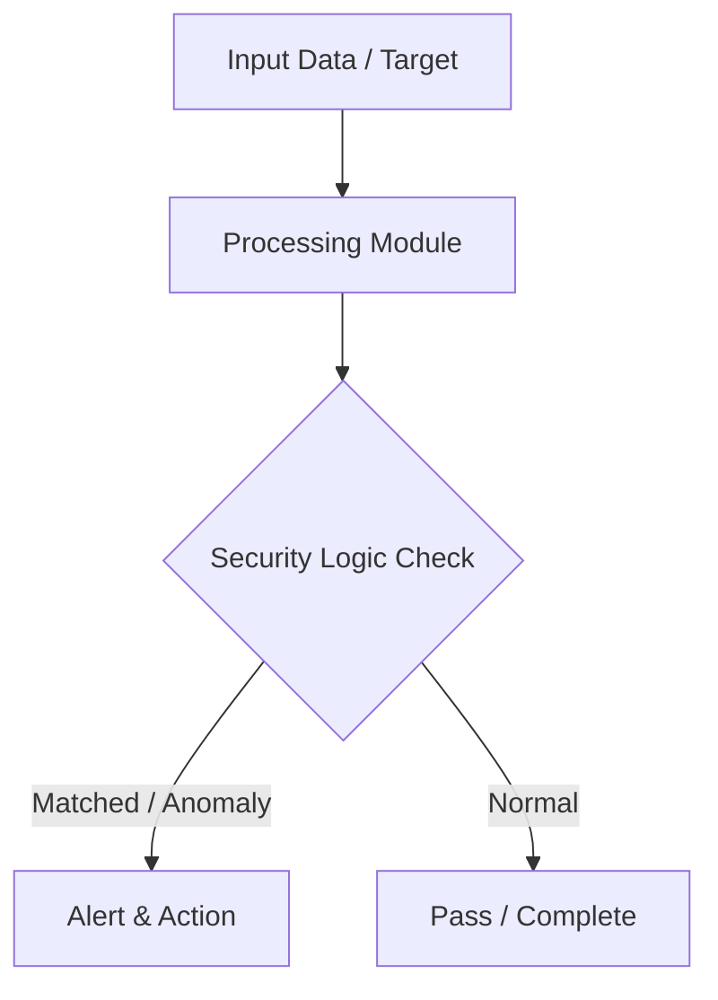

# 019 - Simple Network Ping Sweep and Host Discovery Tool

> **Category**: Basic Cybersecurity Projects | **Difficulty**: ⭐ Basic | **Duration**: 1-2 weeks

---

## Problem Statement and Real World Impact

In network security and system administration, knowing which devices are active on a network segment is the foundation of asset management and security auditing. Network mapping allows administrators to discover undocumented devices, rogue endpoints, or misconfigured hosts that might present an unauthorized access vector. A common, low-noise method for this discovery is performing a ping sweep.

This project introduces network discovery by implementing a multi-threaded ICMP ping sweep tool in Python. By automating the process of sending echo requests to an entire subnet and parsing the responses, you will understand how network scanners operate under the hood to map out active IP addresses in real-time, forming the basis for further vulnerability scanning and network enumeration.

---

## Textbook & Paper References

- **Book Reference**: Computer Networking: A Top-Down Approach by Kurose & Ross (Chapter 4: Network Layer & ICMP Protocol)
- **Research Paper**: Analysis of Active Network Discovery Methods and Subnet Probing Efficiency (ACM SIGCOMM, 2015)

---

## System Architecture

Link: [[Drawing 2026-07-30 22.31.19.excalidraw#Project Basic-019: 019 - Simple Network Ping Sweep and Host Discovery Tool|Excalidraw Architecture Diagram]]



---

## Technical Implementation Code

Python script issuing ICMP echo requests (or socket connections) across an IP range to output active live hosts.

```python
import subprocess
import platform
from concurrent.futures import ThreadPoolExecutor

def ping_host(ip):
    param = "-n" if platform.system().lower() == "windows" else "-c"
    command = ["ping", param, "1", "-w", "1000", ip]
    try:
        output = subprocess.run(command, stdout=subprocess.DEVNULL, stderr=subprocess.DEVNULL)
        if output.returncode == 0:
            print(f"[+] Host ACTIVE: {ip}")
            return ip
    except:
        pass
    return None

def sweep_subnet(subnet_prefix):
    print(f"[*] Starting ICMP ping sweep on subnet: {subnet_prefix}.0/24")
    with ThreadPoolExecutor(max_workers=30) as executor:
        for host in range(1, 255):
            ip = f"{subnet_prefix}.{host}"
            executor.submit(ping_host, ip)

if __name__ == "__main__":
    sweep_subnet("192.168.1")
```

---

## Expected Results & Outcomes

1. A clear understanding of the ICMP protocol and how echo requests/replies facilitate host discovery.
2. A functional, lightweight Python script utilizing multi-threading to efficiently sweep a /24 subnet and display active hosts.
3. Practical insight into active network reconnaissance techniques commonly used during the initial phases of network mapping and penetration testing.

---

## Legal and Ethical Notice

> [!WARNING] Educational Use Only
> Always run these basic projects in your own local testing environment or authorized laboratory network.

---

## Related Index
- [[00 - Basic Cybersecurity Projects Index]]
