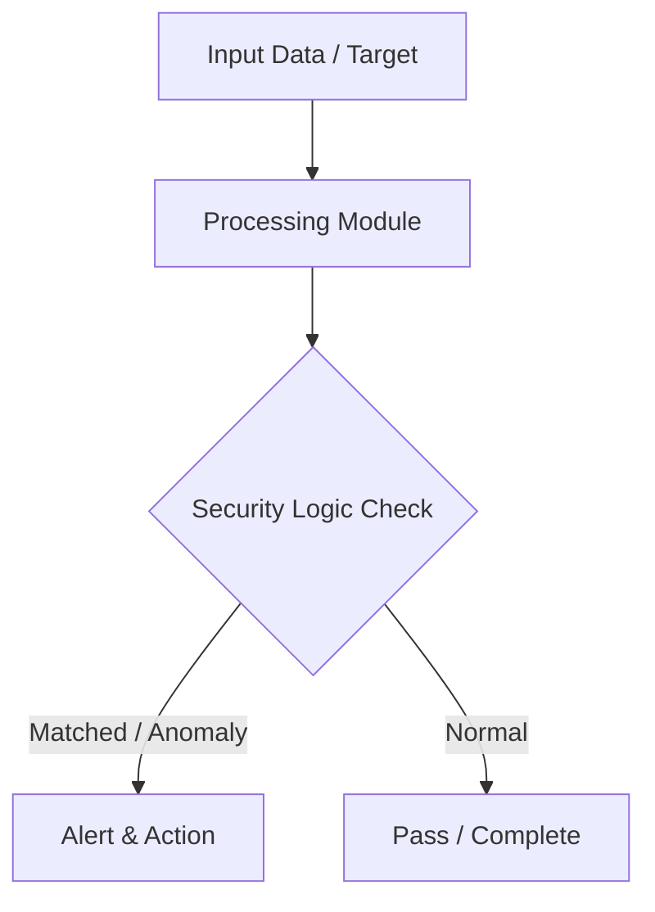

# 020 - Basic USB Drive Auto-Run Infection Prevention Script

> **Category**: Basic Cybersecurity Projects | **Difficulty**: ⭐ Basic | **Duration**: 1-2 weeks

---

## Problem Statement and Real World Impact

Removable USB media remains a persistent vector for malware propagation, particularly in air-gapped environments or industrial control systems. Attackers frequently utilize malicious `autorun.inf` files and hidden executables (like `.vbs`, `.bat`, or `.exe`) that are configured to launch automatically when a drive is connected to a target workstation. Preventing these unauthorized executions is a critical component of endpoint security.

This project addresses the real-world threat of "BadUSB" and physical media malware by creating a defensive monitoring script. The Python script scans newly mounted removable drives, actively hunts for suspicious autorun configurations, and automatically disables them. This practical exercise highlights the mechanics of endpoint detection and the importance of implementing strict removable media controls.

---

## Textbook & Paper References

- **Book Reference**: Windows Security Internals by Mark Russinovich (Chapter 7: Removable Storage Group Policies & Execution Control)
- **Research Paper**: Preventing Malicious USB Removable Media Attacks in Enterprise Workstations (IEEE Security & Privacy, 2017)

---

## System Architecture

Link: [[Drawing 2026-07-30 22.31.19.excalidraw#Project Basic-020: 020 - Basic USB Drive Auto-Run Infection Prevention Script|Excalidraw Architecture Diagram]]



---

## Technical Implementation Code

Python security script scanning newly connected USB drives, searching for autorun.inf files and suspicious .vbs/.bat executables, and renaming/disabling them.

```python
import os
import time
import string

def scan_usb_drives():
    print("[*] USB Monitoring Script Initialized. Scanning removable drives...")
    # List drive letters
    drives = [f"{d}:\\" for d in string.ascii_uppercase if os.path.exists(f"{d}:\\")]
    
    suspicious_extensions = [".autorun", ".vbs", ".bat", ".exe", ".lnk"]
    
    for drive in drives:
        autorun_file = os.path.join(drive, "autorun.inf")
        if os.path.exists(autorun_file):
            print(f"[!] DANGER: Malicious 'autorun.inf' found on drive {drive}!")
            try:
                os.rename(autorun_file, autorun_file + ".disabled")
                print(f"[+] Disabled autorun file on {drive}")
            except Exception as e:
                print(f"[-] Failed to rename file: {e}")

if __name__ == "__main__":
    scan_usb_drives()
```

---

## Expected Results & Outcomes

1. A clear understanding of how removable media malware exploits native operating system execution features like autorun.
2. A functional Python script capable of detecting connected drives, identifying `autorun.inf` and other suspicious files, and neutralizing them by altering their file extensions.
3. Practical insight into defensive endpoint security automation and file system monitoring techniques used in enterprise environments.

---

## Legal and Ethical Notice

> [!WARNING] Educational Use Only
> Always run these basic projects in your own local testing environment or authorized laboratory network.

---

## Related Index
- [[00 - Basic Cybersecurity Projects Index]]
