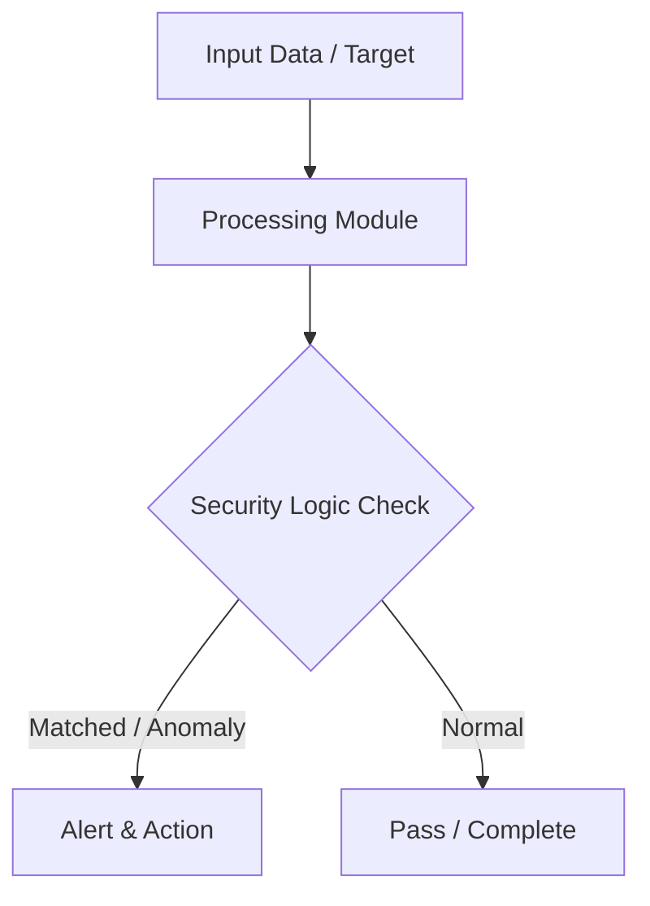

# 020 - Basic USB Drive Auto-Run Infection Prevention Script

> **Category**: Basic Cybersecurity Projects | **Difficulty**: ⭐ Basic | **Duration**: 1-2 weeks

---

## Problem Statement and Real World Impact

Real-world applications me yeh problem kafi common hai. Preventing malicious autorun scripts and unwanted executables from automatically launching when USB drives are attached.

Jab hum beginner-level cybersecurity practicals ki baat karte hain, toh foundational concepts ko code ke zariye samajhna sabse effective tareeka hota hai. Yeh project ek simple Python script ke zariye is real-world problem ko directly solve karta hai.

---

## Textbook & Paper References

- **Book Reference**: Windows Security Internals by Mark Russinovich (Chapter 7: Removable Storage Group Policies & Execution Control)
- **Research Paper**: Preventing Malicious USB Removable Media Attacks in Enterprise Workstations (IEEE Security & Privacy, 2017)

---

## System Architecture

Link: [[Drawing 2026-07-30 22.31.19.excalidraw#Project Basic-020: 020 - Basic USB Drive Auto-Run Infection Prevention Script|Excalidraw Architecture Diagram]]



---

## Technical Implementation Code

Python security script scanning newly connected USB drives, searching for autorun.inf files and suspicious .vbs/.bat executables, and renaming/disabling them.

```python
import os
import time
import string

def scan_usb_drives():
    print("[*] USB Monitoring Script Initialized. Scanning removable drives...")
    # List drive letters
    drives = [f"{d}:\\" for d in string.ascii_uppercase if os.path.exists(f"{d}:\\")]
    
    suspicious_extensions = [".autorun", ".vbs", ".bat", ".exe", ".lnk"]
    
    for drive in drives:
        autorun_file = os.path.join(drive, "autorun.inf")
        if os.path.exists(autorun_file):
            print(f"[!] DANGER: Malicious 'autorun.inf' found on drive {drive}!")
            try:
                os.rename(autorun_file, autorun_file + ".disabled")
                print(f"[+] Disabled autorun file on {drive}")
            except Exception as e:
                print(f"[-] Failed to rename file: {e}")

if __name__ == "__main__":
    scan_usb_drives()

```

---

## Expected Results & Outcomes

1. Clear understanding of underlying networking, hashing, or system security mechanics.
2. Functional, lightweight Python script ready to execute in a local lab.
3. Verification of security controls against common real-world misconfigurations.

---

## Legal and Ethical Notice

> [!WARNING] Educational Use Only
> Always run these basic projects in your own local testing environment or authorized laboratory network.

---

## Related Index
- [[00 - Basic Cybersecurity Projects Index]]
